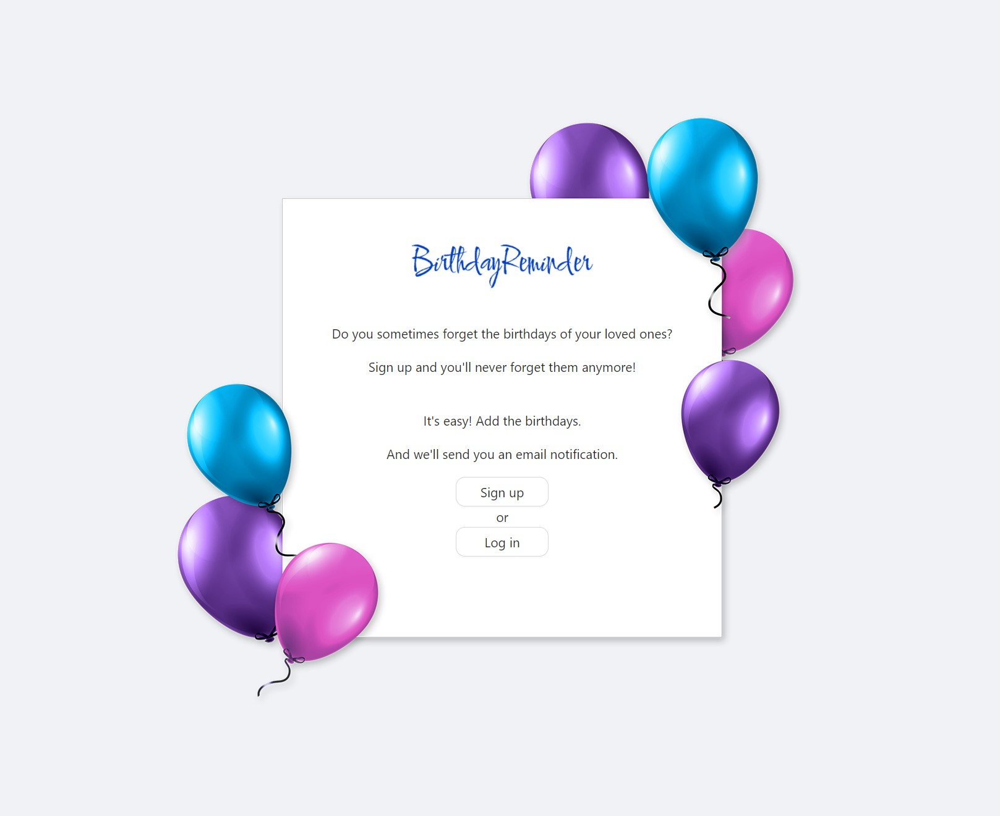

## Autorid:
Anete Vaalu, Anneli Põldaru

 

## Idee:
BirthdayReminder on tore app, mis aitab hoida Sinu sõprade jt lähedaste sünnipäevi ühes kohas koos. Ei pea enam muretsema, et unustad sõpra õnnitleda. :)

 

## Wireframe e Low Fidelity prototüüp
https://app.uizard.io/p/98598791

 

## Funktsionaalsused:
### Kõikidele kasutajatele:
* Näeb avalehte (kohta, kus on rakenduse lühike tutvustus)
* Kasutajaks registreerumise võimalus
* Kasutaja saab sisse logida

### Registreerunud kasutajatele:
* Kasutaja saab välja logida
* Kasutaja näeb sõprade sünnipäevade andmeid
* Kasutaja saab valida, kas vaatab parasjagu tänaseid sünnipäevalisi / nädala jooksul tulevaid / kõiki sünnipäevi
* Kasutaja saab lisada / kustutada / muuta juba sisestatud andmeid
* NB! Kasutaja näeb vaid enda poolt sisestatud andmeid
* Kasutaja saab emaili peale meeldetuletuse, kui sõbra sünnipäev on kätte jõudnud

 

## Rakenduse kuvatõmmised :

 

## Kasutatud tehnoloogiad
* React
* JavaScript ja NodeJS
* ExpressJS
* MongoDB
* Docker

 

## Logo, favicon jms pildimaterjal pärineb:
* https://favicon.io/
* https://pngtree.com/

 

## Installeerimisjuhis
1. Lae repositoorium alla
2. Navigeeri `local-dev` kausta
3. `docker-compose run --rm --no-deps backend install`
4. `docker-compose run --rm --no-deps frontend install`
5. `docker-compose up -d`
  
Frontend - http://localhost:3000/  
Backend- http://localhost:8082/  
  
### Sulgemiseks:  
* `docker-compose stop`

### Mongo DB Compass'iga ühendamiseks:
1. Ava MongoDB Compass
2. Kliki "Fill in connection fields individually" ning täida väljad:
3. Hostname: `localhost`
4. Port: `27017`
5. Authentication'iks määra: `Username / Password`
6. Username: `kasutaja`
7. Password: `birthday`
8. Kliki `Connect` nuppu
